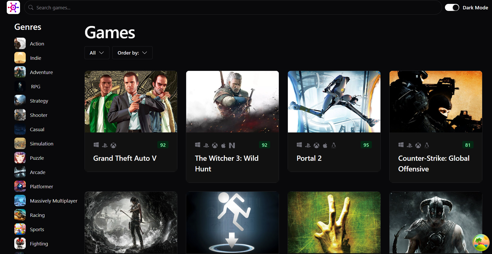

# Game Hub

Game Hub is a web application that allows users to search for games, filter results by platform and genre, view game details and ratings, and watch game trailer videos.

## Features

- 🔍 **Game Search** – Quickly find your favorite games.
- 🎮 **Game Filtering** – Filter games by platform and genre.
- ⭐ **Game Details & Ratings** – Check game descriptions, ratings, and reviews.
- 🎬 **Game Trailers** – Watch game trailer videos directly in the app.

## Requirements

- **Node.js**: Version 20

## Installation & Setup

1. **Clone the repository**:
   ```sh
   git clone https://github.com/zhbdripon/game-hub.git
   ```

2. **Navigate to the project root**:
   ```sh
   cd game-hub
   ```

3. **Install dependencies**:
   ```sh
   npm install
   ```

4. **Run the project**:
   ```sh
   npm run dev
   ```

## License

This project is open-source and available under the [MIT License](LICENSE).

